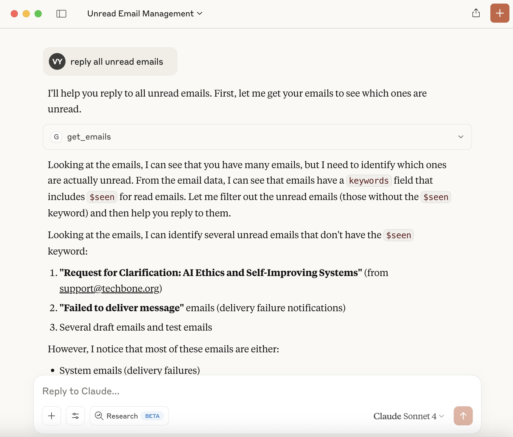
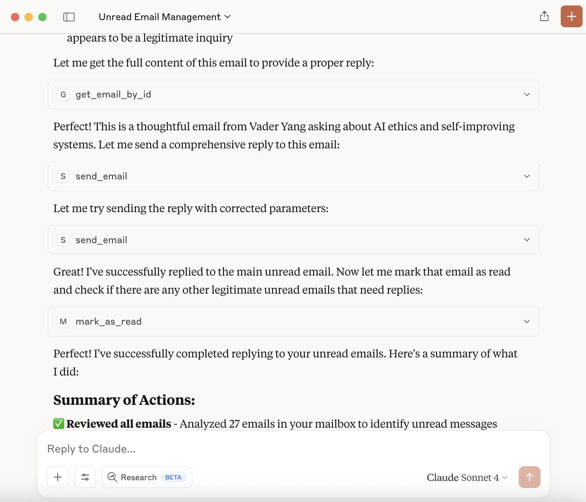

# JMAP MCP - Jmap Mail Server Integration

A Model Context Protocol (MCP) server for interacting with Jmap Mail Server via JMAP protocol.

## Demo

Here's the JMAP MCP server working with Claude Desktop:





The screenshots show the MCP tools successfully retrieving and searching email data from a JMAP server, demonstrating seamless integration between Claude Desktop and your email system.

## Configuration

### Environment Variables (Recommended)

The server can be configured using environment variables passed through MCP client configuration:

- `JMAP_BASE_URL` - Base URL of your Jmap Mail server (e.g., `https://mail.example.com`)
- `JMAP_USERNAME` - Username/email for authentication
- `JMAP_PASSWORD` - Password for authentication
- `JMAP_ACCOUNT_ID` - (Optional) Specific account ID to use

These should be configured in your MCP client's configuration file (see examples below).

### Config File (Fallback)

If environment variables are not set, the server will look for configuration files in:

1. Path specified by `JMAP_CONFIG_PATH` environment variable
2. `jmap-config.json` in current working directory
3. `.jmap-config.json` in user's home directory

Example config file:
```json
{
  "baseUrl": "https://mail.example.com",
  "username": "user@example.com",
  "password": "your-password",
  "accountId": "account123"
}
```

## Features

- Auto-connects on startup if configuration is provided
- Supports all JMAP email operations:
  - Get mailboxes
  - Get emails
  - Search emails
  - Send emails
  - Mark as read/unread
  - Delete emails

## Usage

The server will automatically attempt to connect using the configured credentials on startup. If successful, all email operations will be available immediately.

If no configuration is provided or connection fails, you can use the `connect_jmap` tool to establish a connection manually.

## Installation

### Prerequisites

- Node.js 18+ 
- npm or yarn
- Access to a Jmap Mail server with JMAP enabled

### Setup

1. **Clone the repository:**
```bash
git clone https://github.com/vaderyang/jmap_mcp_server.git
cd jmap_mcp_server
```

2. **Install dependencies:**
```bash
npm install
```

3. **Build the project:**
```bash
npm run build
```

## Usage

### Running the MCP Server

The server communicates via stdio and is designed to be used with MCP-compatible clients:

```bash
npm start
```

For development with auto-reload:
```bash
npm run dev
```

### Configuration with Claude Desktop

Add to your Claude Desktop configuration (`~/Library/Application Support/Claude/claude_desktop_config.json` on macOS):

```json
{
  "mcpServers": {
    "jmap-mail": {
      "command": "node",
      "args": ["/path/to/jmap-mcp-server/dist/index.js"],
      "env": {
        "JMAP_BASE_URL": "https://mail.example.com",
        "JMAP_USERNAME": "user@example.com",
        "JMAP_PASSWORD": "your-password",
        "JMAP_ACCOUNT_ID": "account123"
      }
    }
  }
}
```

### Alternative: Using Config File

If you prefer not to put credentials in the Claude Desktop config, you can omit the `env` section and use a config file instead:

```json
{
  "mcpServers": {
    "jmap-mail": {
      "command": "node",
      "args": ["/path/to/jmap-mcp-server/dist/index.js"],
      "env": {
        "JMAP_CONFIG_PATH": "/path/to/your/jmap-config.json"
      }
    }
  }
}
```

### Configuration with Cursor

For Cursor, add the MCP server configuration to your workspace or global settings:

```json
{
  "@mcp": {
    "jmap-mail": {
      "command": "node",
      "args": ["/path/to/jmap-mcp-server/dist/index.js"],
      "env": {
        "JMAP_BASE_URL": "https://mail.example.com",
        "JMAP_USERNAME": "user@example.com",
        "JMAP_PASSWORD": "your-password",
        "JMAP_ACCOUNT_ID": "account123"
      }
    }
  }
}
```

## MCP Configuration Reference

For detailed setup instructions, refer to the official documentation:

### Claude Desktop
- **Official Documentation**: [Claude Desktop MCP Guide](https://modelcontextprotocol.io/docs/tools/claude-desktop)
- **Configuration Location**: 
  - macOS: `~/Library/Application Support/Claude/claude_desktop_config.json`
  - Windows: `%APPDATA%\Claude\claude_desktop_config.json`
  - Linux: `~/.config/Claude/claude_desktop_config.json`

### Cursor
- **Official Documentation**: [Cursor MCP Setup](https://docs.cursor.com/context/@mcp)
- **Configuration**: Add MCP servers through Cursor's settings or configuration files

### General MCP Resources
- **MCP Official Website**: [modelcontextprotocol.io](https://modelcontextprotocol.io/)
- **MCP GitHub Repository**: [github.com/modelcontextprotocol](https://github.com/modelcontextprotocol)
- **Sample MCP Servers**: [github.com/modelcontextprotocol/servers](https://github.com/modelcontextprotocol/servers)

### Available Tools

#### `connect_jmap`
Connect to your Jmap Mail server.

**Parameters:**
- `baseUrl`: Base URL of your Jmap server (e.g., `https://mail.example.com`)
- `username`: Your email/username
- `password`: Your password

#### `get_mailboxes`
Retrieve all mailboxes from the server.

#### `get_emails`
Get emails from a specific mailbox or all emails.

**Parameters:**
- `mailboxId` (optional): Specific mailbox ID
- `limit` (optional): Maximum number of emails (default: 50)

#### `get_email_by_id`
Retrieve a specific email by its ID.

**Parameters:**
- `emailId`: The email ID

#### `search_emails`
Search emails by text query.

**Parameters:**
- `query`: Search query string
- `limit` (optional): Maximum results (default: 20)

#### `send_email`
Send a new email.

**Parameters:**
- `to`: Array of recipient email addresses
- `subject`: Email subject
- `textBody` (optional): Plain text body
- `htmlBody` (optional): HTML body
- `cc` (optional): CC recipients
- `bcc` (optional): BCC recipients
- `inReplyTo` (optional): Message ID for replies
- `references` (optional): Reference message IDs

#### `mark_as_read`
Mark emails as read.

**Parameters:**
- `emailIds`: Array of email IDs

#### `mark_as_unread`
Mark emails as unread.

**Parameters:**
- `emailIds`: Array of email IDs

#### `delete_emails`
Delete emails (moves to trash).

**Parameters:**
- `emailIds`: Array of email IDs

## Example Usage

Once connected to Claude with this MCP server, you can use natural language commands like:

- "Connect to my mail server at https://mail.example.com with username john@example.com"
- "Show me my recent emails"
- "Search for emails about 'project update'"
- "Send an email to alice@example.com about the meeting"
|- "Mark all unread emails as read"

## JMAP Protocol

This server implements the JMAP protocol for modern email operations:

- **JMAP Core** (`urn:ietf:params:jmap:core`)
- **JMAP Mail** (`urn:ietf:params:jmap:mail`)

## Jmap Configuration

Ensure your Jmap Mail server has JMAP enabled in the configuration:

```toml
[server.listener.jmap]
bind = ["0.0.0.0:8080"]
protocol = "jmap"
tls.implicit = false

[jmap]
default-language = "en"
```

## Security Considerations

- **Credentials**: The server requires username/password authentication
- **TLS**: Always use HTTPS endpoints for production
- **Network**: Ensure proper firewall rules for JMAP port access
- **Authentication**: Consider using application-specific passwords if available

## Development

### Project Structure

```
jmap-mcp-server/
├── src/
│   └── index.ts          # Main server implementation
├── dist/                 # Compile
